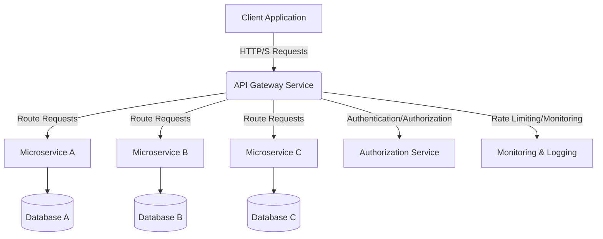
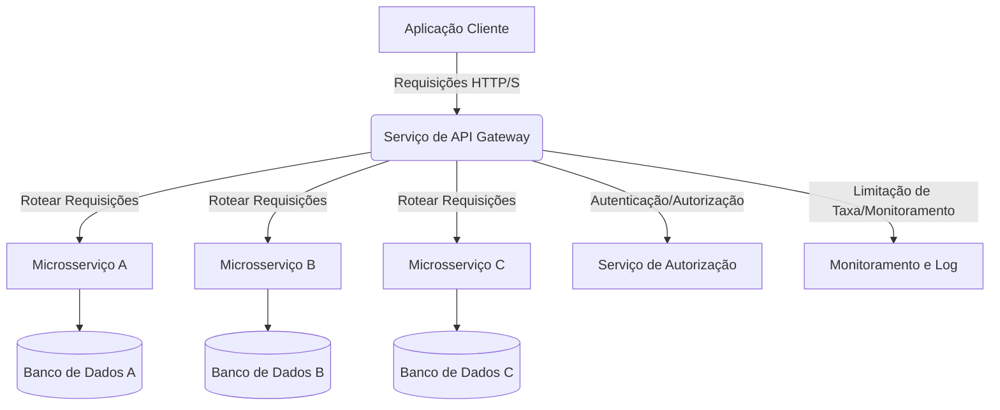

# TypeScript-API-Gateway

<div align="center">


**Enterprise API Gateway Service**

*Enterprise-grade TypeScript application with type safety and modern architecture*

[🇺🇸 English](#english) | [🇧🇷 Português](#português)

</div>

---

## 🇺🇸 English

### 📋 Overview



Enterprise API Gateway Service built with TypeScript for enhanced type safety and developer experience. This project demonstrates advanced TypeScript development skills, modern Node.js architecture, and enterprise-level software engineering practices.

### ✨ Key Features

• Centralized API management
• Request routing and load balancing
• Authentication and authorization
• Rate limiting and throttling
• API versioning support
• Real-time monitoring and analytics
• Circuit breaker pattern
• Comprehensive logging and tracing

### 🛠️ Technology Stack

- **TypeScript 5.0+** - Strongly typed JavaScript superset
- **Node.js 18+** - JavaScript runtime environment
- **Express.js 4.18+** - Web application framework
- **ESLint** - Code linting and formatting
- **Prettier** - Code formatting
- **Jest** - Testing framework with TypeScript support
- **ts-node** - TypeScript execution environment

### 🚀 Quick Start

#### Prerequisites
- Node.js 18 or higher
- npm 8 or higher
- TypeScript knowledge

#### Installation & Setup

1. **Clone the repository**
   ```bash
   git clone https://github.com/galafis/TypeScript-API-Gateway.git
   cd TypeScript-API-Gateway
   ```

2. **Install dependencies**
   ```bash
   npm install
   ```

3. **Build the project**
   ```bash
   npm run build
   ```

4. **Start development server**
   ```bash
   npm run dev
   ```

5. **Start production server**
   ```bash
   npm start
   ```

### 📖 Usage Examples

#### Type-Safe API Usage

```typescript
// Example API interface
interface ApiResponse<T> {
  success: boolean;
  data: T;
  message?: string;
}

// Usage example
const response: ApiResponse<User> = await fetchUser(userId);
```

### 🏗️ Estrutura do Projeto

```
TypeScript-API-Gateway/
├── src/
│   ├── config/             # Arquivos de configuração
│   ├── controllers/        # Manipuladores de requisições
│   ├── middleware/         # Middlewares do Express
│   ├── models/             # Modelos de dados e interfaces
│   ├── routes/             # Definições de rotas da API
│   ├── services/           # Serviços de lógica de negócios
│   ├── types/              # Tipos TypeScript personalizados
│   ├── utils/              # Funções utilitárias
│   └── server.ts           # Ponto de entrada principal da aplicação
├── tests/                  # Testes unitários e de integração
├── dist/                   # Saída JavaScript compilada
├── .github/                # Configurações específicas do GitHub (ex: workflows, GitHub Pages)
├── package.json            # Dependências e scripts do projeto
├── tsconfig.json           # Configuração do compilador TypeScript
├── jest.config.js          # Configuração do Jest para testes
├── .eslintrc.js            # Configuração do ESLint
└── README.md               # Documentação do projeto
```


### 🧪 Testing

```bash
# Run tests
npm test

# Run tests with coverage
npm run test:coverage

# Type checking
npm run type-check
```

### 📝 License

This project is licensed under the MIT License - see the [LICENSE](LICENSE) file for details.

### 👨‍💻 Author

**Gabriel Demetrios Lafis**
- GitHub: [@galafis](https://github.com/galafis)
- LinkedIn: [Gabriel Demetrios Lafis](https://linkedin.com/in/gabriel-lafis)

---

## 🇧🇷 Português

### 📋 Visão Geral



Enterprise API Gateway Service construído com TypeScript para maior segurança de tipos e experiência do desenvolvedor. Este projeto demonstra habilidades avançadas de desenvolvimento TypeScript, arquitetura moderna Node.js e práticas de engenharia de software de nível empresarial.

### ✨ Principais Funcionalidades

• Centralized API management
• Request routing and load balancing
• Authentication and authorization
• Rate limiting and throttling
• API versioning support
• Real-time monitoring and analytics
• Circuit breaker pattern
• Comprehensive logging and tracing

### 🛠️ Stack Tecnológica

- **TypeScript 5.0+** - Superset do JavaScript com tipagem forte
- **Node.js 18+** - Ambiente de execução JavaScript
- **Express.js 4.18+** - Framework de aplicação web
- **ESLint** - Linting e formatação de código
- **Prettier** - Formatação de código
- **Jest** - Framework de testes com suporte TypeScript
- **ts-node** - Ambiente de execução TypeScript

### 🚀 Início Rápido

#### Pré-requisitos
- Node.js 18 ou superior
- npm 8 ou superior
- Conhecimento em TypeScript

#### Instalação e Configuração

1. **Clone o repositório**
   ```bash
   git clone https://github.com/galafis/TypeScript-API-Gateway.git
   cd TypeScript-API-Gateway
   ```

2. **Instale as dependências**
   ```bash
   npm install
   ```

3. **Compile o projeto**
   ```bash
   npm run build
   ```

4. **Inicie o servidor de desenvolvimento**
   ```bash
   npm run dev
   ```

5. **Inicie o servidor de produção**
   ```bash
   npm start
   ```

### 📝 Licença

Este projeto está licenciado sob a Licença MIT - veja o arquivo [LICENSE](LICENSE) para detalhes.

### 👨‍💻 Autor

**Gabriel Demetrios Lafis**
- GitHub: [@galafis](https://github.com/galafis)
- LinkedIn: [Gabriel Demetrios Lafis](https://linkedin.com/in/gabriel-lafis)

---

<div align="center">

**⭐ Se este projeto foi útil para você, considere dar uma estrela!**

**🚀 Desenvolvido com ❤️ por Gabriel Demetrios Lafis**

</div>
